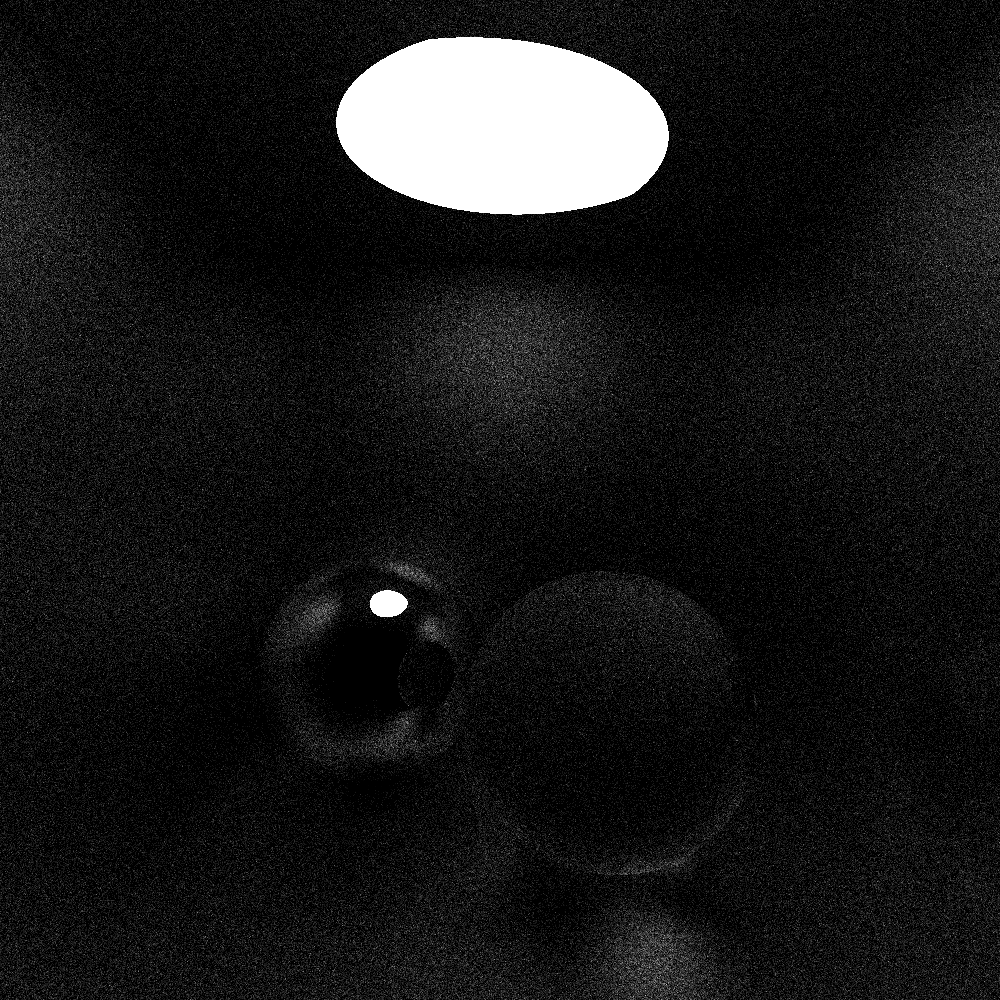
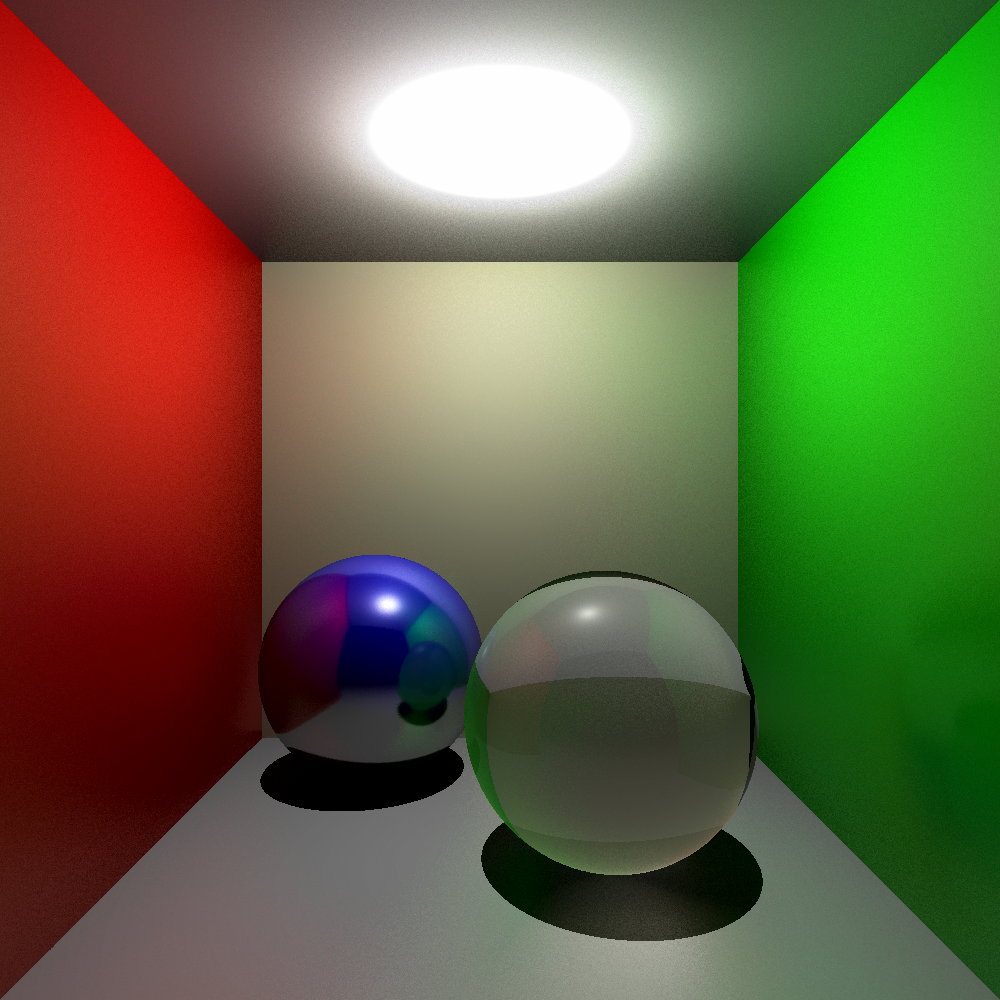

# I'm already raytracer

A raytracer written by Mathias Magnusson

## Pictures

The ball is not where it's supposed to be and there is weird distortion.

The ball is still wrong but the distortion is gone, at the expense of the fov being hardcoded at 90°

The ball is now at the correct place! Also, planes can be bounded and reflections are working! Now it's also multithreaded!

The right ball is supposed to be like glass, but the refractions are not working as intended. The reflections have some randomness based on the materials roughness.

Added lights. Colors are now gone.

Okay now this is pretty cool.

I fixed a bug with the shadows but why are they now so large?